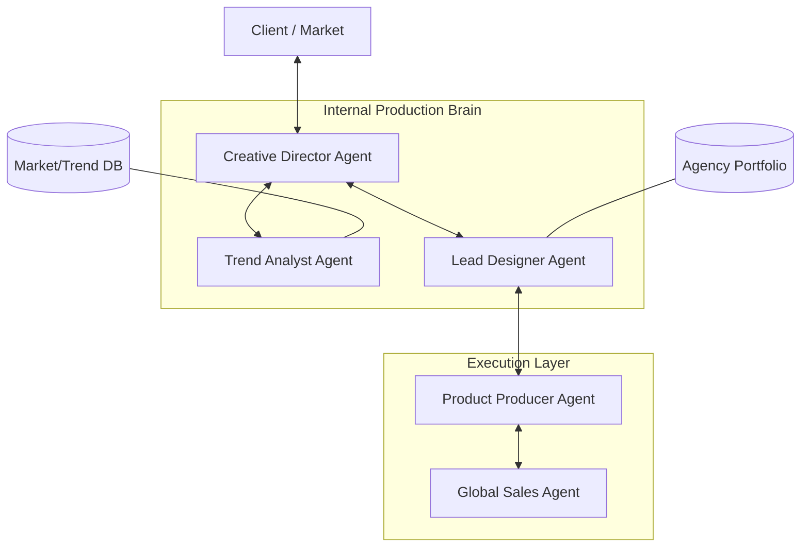

# Agency Topology: Interaction Structure

## 1. External Nodes
- **Market/Client**: The source of demands and trends.
- **Consumer**: The final destination for products.

## 2. Agent Infrastructure
- **Decision Hub (CD)**: Orchestrates the flow and maintains the philosophy.
- **Knowledge Node (Analyst)**: Feeds innovation and data-driven insights.
- **Creative Node (Designer)**: Translates philosophy into visuals.
- **Action Node (Product/Sales)**: Executes the real-world manufacturing and transaction.
